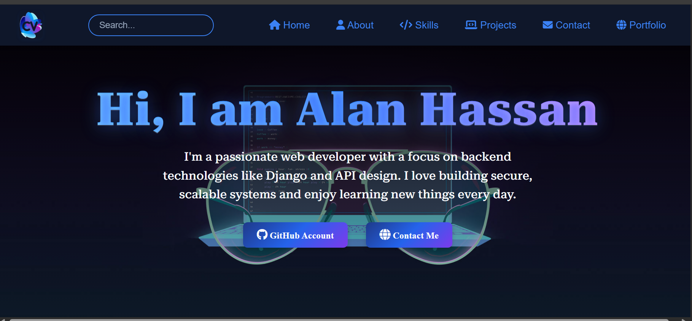
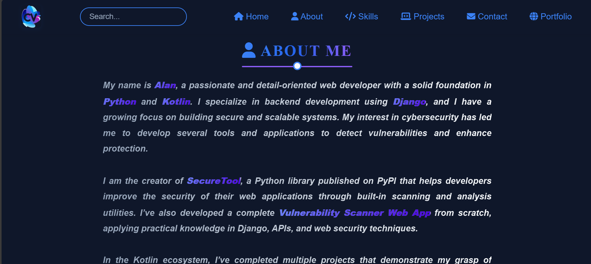
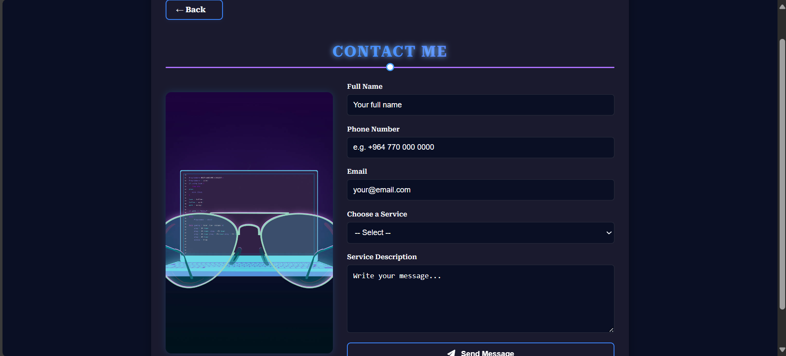
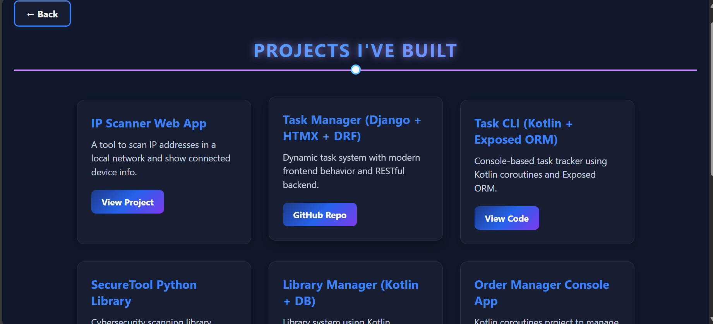
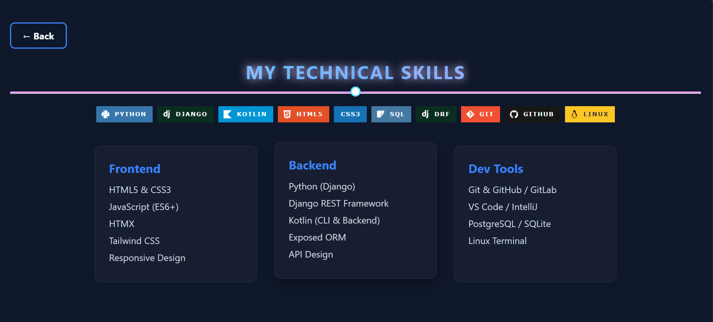

# Frontend Practice: Online CV

## Overview
This is a practical frontend development exercise focused on building a clean, responsive online CV. The project serves as a hands-on way to practice and demonstrate frontend skills.

### Main Page


### About section


### Contact Page


### Project page


### Skills page


## Project Structure
```
Web_Project/
├── index.html              # Main HTML file
├── contact.html            # Contact page
├── project.html            # Projects page
├── skills.html             # Skills page
├── css/
│   ├── style.css           # Main stylesheet
│   ├── contact.css         # Styles for contact page
│   ├── project.css         # Styles for projects page
│   └── skills.css          # Styles for skills page
└── assets/                 # For images, icons, etc.
```

---
*Frontend practice project - Jul 2025*